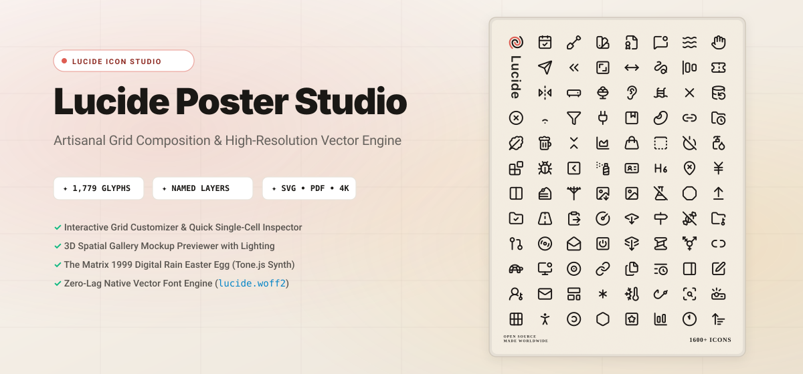
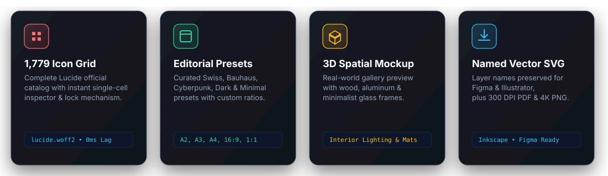
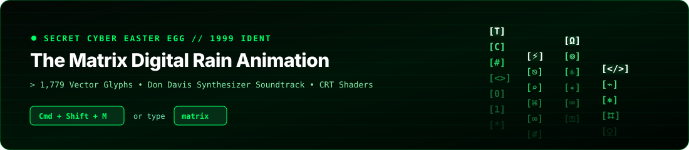

<p align="center">
  
</p>

<p align="center">
  <a href="https://react.dev/"></a>
  <a href="https://www.typescriptlang.org/"></a>
  <a href="https://vite.dev/"></a>
  <a href="https://tailwindcss.com/"></a>
  <a href="https://lucide.dev/"></a>
  <a href="https://tonejs.github.io/"></a>
</p>

---

## ✦ Overview

**Lucide Poster Studio** is a state-of-the-art, artisanal web application designed to generate, curate, customize, and export high-resolution editorial iconography posters powered by the complete **1,779+ official Lucide Icons** library.

Whether creating wall art prints for design studios, technical cheat sheets, developer conference swags, or digital wallpapers, Lucide Poster Studio provides a fine-tuned, typography-grade canvas engine with instant real-world mockup previewing and named vector export.

---

<p align="center">
  
</p>

---

## ✨ Key Features

### 📐 1. Editorial Grid Engine & Ratio Architect
- **Flexible Grid Formats**: Configure custom columns and rows from `2×2` up to `24×24` or dense typographic sheets.
- **Aspect Ratios**: ISO Standard Paper (`A2`, `A3`, `A4`), Architectural (`3:4`, `4:5`, `2:3`), Widescreen (`16:9`), and Square (`1:1`).
- **Dynamic Harmonizer**: Fine-tune margins, cell paddings, border radius, background gradients, textures (Noise, Subtle Grain, Blueprint, Dots, Isometric Grid), and header/footer metadata.

### 🔍 2. Single-Cell Inspector & Lock Mechanism
- Click any icon in the canvas to open the **Quick Inspector**.
- **Search & Replace**: Swap any cell with any of the 1,779 Lucide icons with instant live preview.
- **Cell Pinning/Locking**: Lock specific favorite icons so that global shuffles only randomize unlocked cells.
- **Custom Accent Tinting**: Color-grade individual cells to create focal points and visual rhythms.

### 🖼️ 3. 3D Spatial Gallery Mockup Stage
- Interactive real-world interior preview stage.
- **Curated Framing**: Natural Oak Wood, Matte Black Aluminum, Brushed Gold, and Frameless Studio Glass.
- **Interior Environments**: Minimalist Concrete Loft, Warm Scandinavian Living Room, Modern Creative Studio, and Dark Velvet Gallery.
- **Lighting & Mat Customization**: Real-time passe-partout mat thickness and directional spotlight shadow simulation.

### 🖨️ 4. Print Production & High-Resolution Vector Export
- **Named SVG Layer Export**: Preserves clean hierarchy and exact icon names in `<title>`, `id`, `data-name`, and `inkscape:label` attributes for seamless editing in **Figma**, **Adobe Illustrator**, and **Inkscape**.
- **Ultra High-Res PNG**: Export at `1x`, `2x`, `3x`, or `4x` (up to 8K resolution).
- **Print-Ready PDF**: Vector-embedded PDF export configured for professional CMYK printing with optional crop/bleed registration marks.

---

<p align="center">
  
</p>

### 🕶️ 5. The Matrix Digital Rain Easter Egg
An authentic, full-screen cybernetic digital rain animation running at **60 FPS**:
- **1,779 Falling Glyphs**: Cascading vector glyphs powered by `lucide.woff2` and native GPU font rendering.
- **Soundtrack**: Authentic synthesized orchestral polytonal score (Dm vs Ebm brass swells, 16th-note Phrygian code arpeggios, sub-bass drones) created with **Tone.js**.
- **Cyber Controls**: Switch between 5 cyberpunk color themes (*Classic 1999*, *Trinity Cyan*, *Zion Amber*, *Agent Red*, *Ghost Monochrome*).

---

## 🚀 Quick Start

### Prerequisites
- [Node.js](https://nodejs.org/) (v18.0.0 or higher)
- Package manager: `npm`, `pnpm`, or `yarn`

### Installation & Run

```bash
# 1. Clone the repository
git clone https://github.com/martinproject/lucide-poster-studio.git
cd lucide-poster-studio

# 2. Install dependencies
pnpm install
# or: npm install / yarn install

# 3. Start local development server
pnpm dev
# or: npm run dev / yarn dev
```

Open [http://localhost:3000](http://localhost:3000) in your browser.

---

## 🛠️ Tech Stack & Architecture

| Layer | Technologies |
| :--- | :--- |
| **Core Framework** | [React 19](https://react.dev/) + [TypeScript 5.8](https://www.typescriptlang.org/) |
| **Build & Bundler** | [Vite 6](https://vite.dev/) |
| **Styling & Design System** | [Tailwind CSS v4](https://tailwindcss.com/) + Custom Design Tokens |
| **Iconography Engine** | [Lucide React](https://lucide.dev/) + [Lucide WOFF2 Vector Font](https://lucide.dev/guide/static/font/) |
| **Audio Synthesis** | [Tone.js](https://tonejs.github.io/) (PolySynth, MonoSynth, Reverb, Compressor, Limiter) |
| **Export Formats** | Named Layer Vector SVG, [jsPDF](https://github.com/parallax/jsPDF) (PDF), [html2canvas](https://html2canvas.hertzen.com/) (High-DPI PNG) |

---

## ⌨️ Keyboard Shortcuts

| Shortcut | Action |
| :--- | :--- |
| <kbd>Cmd</kbd> / <kbd>Ctrl</kbd> + <kbd>Z</kbd> | Undo last poster modification |
| <kbd>Cmd</kbd> / <kbd>Ctrl</kbd> + <kbd>Shift</kbd> + <kbd>Z</kbd> | Redo modification |
| <kbd>Cmd</kbd> / <kbd>Ctrl</kbd> + <kbd>Shift</kbd> + <kbd>M</kbd> | Toggle **The Matrix Code** Easter Egg |
| Type `matrix` | Trigger **The Matrix Code** Easter Egg |
| <kbd>Space</kbd> *(in Matrix)* | Cycle Matrix color themes |
| <kbd>R</kbd> *(in Matrix)* | Shuffle digital rain streams |
| <kbd>M</kbd> *(in Matrix)* | Mute / Unmute Synthesizer Soundtrack |
| <kbd>Esc</kbd> | Close any open modal or return from Matrix |

---

## 📄 License

MIT © [Lucide Poster Studio](https://github.com/martinproject/lucide-poster-studio).  
Icons by [Lucide Contributors](https://lucide.dev) under the ISC License.
